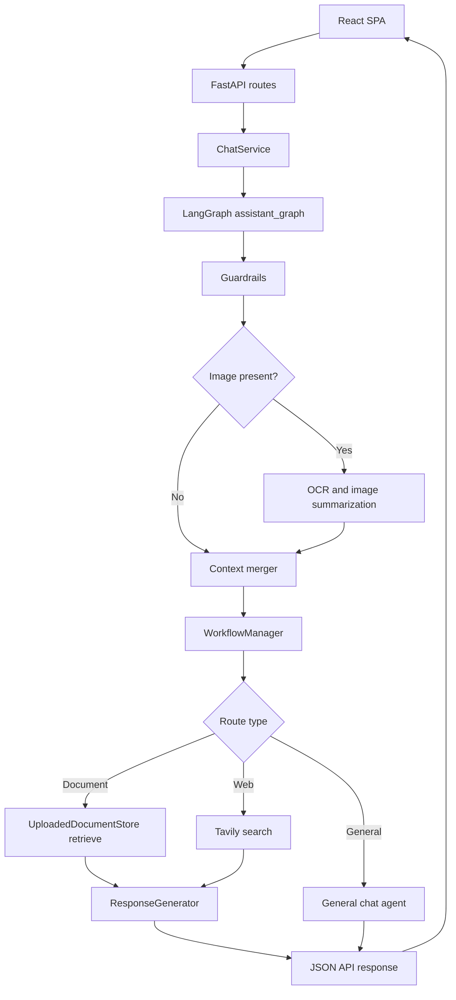
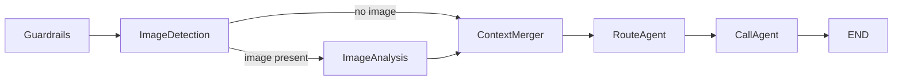

# Project Documentation

This document is the single end-to-end reference for the current implementation in this repository. It explains the live code under `backend/` and `frontend/`, the RAG pipeline, the orchestration graph, the web layer, and the routing model.

## 1. Project Summary

DocWise AI is a session-based AI assistant built around a document-first workflow.

It supports four primary user journeys:

- Upload a PDF, DOCX, or TXT file and ask grounded questions about that uploaded content.
- Ask live or current-information questions and get a web-grounded answer.
- Upload an image and let the system extract OCR context before answering.
- Reopen the app in the same browser and restore the conversation history for the same session ID.

The project is optimized for dynamic, per-session uploads rather than a shared persistent knowledge base.

## 2. Major Features

- Session-scoped document ingestion for PDF, DOCX, and TXT.
- Hybrid RAG retrieval with dense embeddings, BM25, reciprocal rank fusion, cross-encoder reranking, and HyDE.
- LangGraph orchestration for guardrails, image branching, routing, and response delivery.
- Confidence-based fallback from uploaded-document retrieval to web search.
- OCR-based processing for user-uploaded images.
- Markdown answers with source links.
- Debug assets for chunk inspection and offline evaluation runs.

## 3. Tech Stack

| Layer | Technologies | Why they are used |
|---|---|---|
| Backend API | Python, FastAPI, Pydantic | HTTP API, schema validation, request handling |
| Orchestration | LangGraph, LangChain Core | Multi-step workflow, shared state, session-aware graph execution |
| LLMs | Groq via `langchain-groq` | General chat, RAG answer generation, query rewriting, OCR summarization, HyDE |
| Retrieval | HuggingFace embeddings, sentence-transformers, rank-bm25 | Dense retrieval, reranking, lexical retrieval |
| Document parsing | PyMuPDF / `pymupdf4llm`, python-docx | PDF and DOCX extraction |
| Image handling | Pillow, pytesseract | OCR and image preprocessing |
| Web search | Tavily via `langchain-tavily` | Live/current web retrieval |
| Frontend | React 18, Vite 5, react-markdown | Single-page chat UI and markdown rendering |
| Testing | `unittest`, FastAPI `TestClient` | Route and workflow regression coverage |
| Evaluation | custom evaluator in `backend/tests/eval/` | Retrieval, generation, routing, and system-level quality checks |

## 4. Repository Structure

The actual runtime code lives under `backend/` and `frontend/`.

### Top-level files and folders

| Path | Purpose |
|---|---|
| `backend/` | Python backend, agents, API routes, tests, debug artifacts, eval outputs |
| `frontend/` | React/Vite single-page frontend |
| `requirements.txt` | Python dependencies |
| `README.md` | Quick-start and high-level overview |
| `PROJECT_DOCUMENTATION.md` | This end-to-end implementation guide |
| `RAG_ALGORITHM_DETAILS.md` | Specialized RAG design notes |

### Important backend runtime files

| Path | Responsibility |
|---|---|
| `backend/main.py` | FastAPI app creation, logging, CORS, router registration |
| `backend/api/routes/chat.py` | All current API endpoints |
| `backend/api/schemas.py` | Pydantic request/response models |
| `backend/services/chat_service.py` | Main request orchestration entry point |
| `backend/agents/agent_decision.py` | LangGraph workflow definition |
| `backend/agents/workflow_manager.py` | Document/web/general routing and fallback policy |
| `backend/agents/query_router.py` | Rule-based query classification |
| `backend/agents/query_merger.py` | Follow-up query rewriting / context merge |
| `backend/agents/document_ingestion.py` | File extraction and chunking |
| `backend/agents/uploaded_document_store.py` | In-memory document indexing and hybrid retrieval |
| `backend/agents/rag_agent/response_generator.py` | Final grounded answer synthesis |
| `backend/agents/web_search/tavily_search.py` | Tavily integration |
| `backend/agents/general_chat_agent.py` | General conversation path |
| `backend/agents/guardrails.py` | Local regex-based input safety gate |
| `backend/agents/vision_agents/image_analysis_agent.py` | OCR and OCR-text summarization for uploaded images |
| `backend/core/config.py` | Central configuration and feature flags |
| `backend/tests/` | Unit tests and eval tooling |
| `backend/chunk_debug/` | Human-readable chunk dumps from ingestion |
| `backend/eval_runs/` | Persisted evaluation outputs |

## 5. End-to-End Flow

The main runtime loop is:

1. The frontend creates or reuses a browser `session_id`.
2. The user types a message, attaches a file, or does both.
3. FastAPI forwards the request to `ChatService`.
4. `ChatService` invokes the LangGraph workflow using `session_id` as the graph thread ID.
5. The graph applies guardrails, handles image context if needed, and asks `WorkflowManager` to route the query.
6. The workflow executes one of three response paths:
   - document RAG
   - web search + grounded generation
   - general chat
7. The response is returned to the frontend and rendered as markdown.

### 5.1 Detailed document attachment timeline

When a document is attached in the UI, work starts before the user presses Send.

1. `frontend/src/App.jsx` stores the selected document in local React state and shows a file preview.
2. The frontend immediately sends multipart form data to `/api/ingest` with `session_id` and the file.
3. `/api/ingest` calls `ingestion_tracker.start(session_id, filename)`.
4. If that file is already being tracked for the same session, the route returns `already_indexed` and does not schedule duplicate work.
5. Otherwise, FastAPI schedules `chat_service.ingest_document_background(...)` as a background task and returns `202` immediately.
6. The background worker calls `uploaded_document_store.add_file(...)`, which performs the real indexing pipeline:
    - extract text from PDF, DOCX, or TXT
    - chunk the extracted text
    - write a chunk-debug text file
    - embed every chunk
    - store chunk text, metadata, embeddings, lexical terms, and filename under the current session
    - mark the BM25 cache dirty so it will be rebuilt lazily on retrieval
7. After indexing succeeds, the backend appends a synthetic `[Uploaded file: filename]` `HumanMessage` into LangGraph history so the upload appears in restored conversation state.
8. The ingestion tracker is then marked `DONE` with the indexed chunk count.

### 5.2 What happens when the user finally presses Send

The send-time behavior depends on the file type and whether background indexing already finished.

For document uploads:

1. The frontend sends the file and optional message to `/api/upload`.
2. `ChatService.process_upload(...)` checks the ingestion tracker for `(session_id, filename)`.
3. If the status is `DONE`, the backend skips re-ingestion.
4. If the status is `PENDING`, the backend waits up to 120 seconds for the background job to finish.
5. If there is no status, which can happen for direct API callers that never used `/api/ingest`, the backend performs synchronous ingestion inside `/api/upload`.
6. If a message was included, the backend immediately continues into the normal text graph flow after the document is ready.
7. If no message was included, the backend returns a document-upload confirmation containing the indexed chunk count.

For image uploads:

1. The frontend does not call `/api/ingest` when the user merely selects an image.
2. The image is only sent on `/api/upload` when the user submits.
3. The backend routes the image through OCR and image summarization, not through document chunking and embedding.

## 6. API Layer and Route Surface

All current endpoints are defined in `backend/api/routes/chat.py` and use the API prefix from `backend/core/config.py`, which defaults to `/api`.

| Route | Method | Input | Output | Purpose |
|---|---|---|---|---|
| `/api/health` | `GET` | none | `{status: "ok"}` | Liveness check |
| `/api/history` | `POST` | JSON body with `session_id` | `history` + `uploaded_files` | Restore session state in the UI |
| `/api/ingest` | `POST` | multipart form with `file` and `session_id` | `IngestResponse` with `202` | Start background text extraction, chunking, embedding, and session indexing as soon as a document is selected |
| `/api/chat` | `POST` | multipart form with `message` and `session_id` | `ChatResponse` | Text-only prompt path |
| `/api/upload` | `POST` | multipart form with `file`, `session_id`, optional `message` | `ChatResponse` | File submit path that either reconciles document ingestion state or runs the image-analysis flow |

### Response schemas

- `ChatResponse` returns `response`, `sources`, `confidence`, and `query_type`.
- `HistoryResponse` returns serialized message history and the list of uploaded file names for the session.
- `IngestResponse` returns ingestion status such as `indexing` or `already_indexed`, but the actual heavy indexing work continues after the `202` response in a background task.

## 7. Routing Model

There are four distinct routing layers in the project.

### 7.1 Frontend routing

The frontend does not use React Router. It is a single-page application implemented primarily in `frontend/src/App.jsx`.

That means:

- there are no client-side pages or nested routes
- every user action stays inside the same screen
- routing in this project mostly means API routing and internal workflow routing

### 7.2 HTTP routing

FastAPI exposes only one router today, under `/api`, with five endpoints:

- `/health`
- `/history`
- `/ingest`
- `/chat`
- `/upload`

### 7.3 Graph routing

Inside LangGraph, the `ImageDetection` node decides whether the request should go through the image-analysis path or skip straight to text handling.

### 7.4 Query routing

Inside `backend/agents/query_router.py`, the system decides whether the request is:

- `general`
- `document`
- `web`

The decision order is important:

1. Empty query -> `general`
2. Greeting or conversation-meta patterns -> `general`
3. Document-oriented patterns -> `document`
4. Web/current-information patterns -> `web`
5. If uploaded documents exist and no earlier rule matched -> `document`
6. Otherwise -> `web`

This means document-oriented keywords are checked before web keywords, and uploaded documents bias the system toward document retrieval for ambiguous questions.

## 8. Orchestration Details

The orchestration layer is implemented in `backend/agents/agent_decision.py` and compiled as `assistant_graph`.

### 8.1 Graph state

The graph keeps a typed state with these important fields:

- `input`: current user text, possibly merged with image context
- `session_id`: session identifier used as the LangGraph thread ID
- `image`: raw uploaded image bytes when present
- `image_context`: OCR-derived summary for image requests
- `agent_name`: selected branch name such as `DOCUMENT_AGENT`
- `workflow_response`: intermediate response produced by `WorkflowManager`
- `response`: final response payload returned from the graph
- `messages`: accumulated chat history, merged by LangGraph's `add_messages` reducer
- `chat_history`: snapshot of prior messages supplied for retrieval and rewriting logic

### 8.2 Checkpointing and memory

The graph uses `InMemorySaver`, not a database-backed checkpointer.

Important consequences:

- message history persists only for the current Python process
- restarting the backend clears graph history
- the `session_id` is used as `thread_id`, which lets LangGraph restore prior turns for the same session

### 8.3 Node-by-node behavior

| Node | Responsibility | Key behavior |
|---|---|---|
| `Guardrails` | Run local safety checks for text input | Blocks empty or unsafe text requests before any downstream work |
| `ImageDetection` | Branch graph based on image presence | Sends image uploads to OCR/image analysis |
| `ImageAnalysis` | Run OCR and summarize extracted text | Uses Tesseract + LLM summarization for uploaded user images |
| `ContextMerger` | Merge text and image-derived context | Appends image context into the effective query |
| `RouteAgent` | Call `WorkflowManager.process_query(...)` | Chooses document, web, or general branch |
| `CallAgent` | Produce the final response | Uses `general_chat_agent` for general chat, otherwise returns the workflow output |

### 8.4 Important orchestration details

- Guardrails are skipped for non-text input types.
- Uploaded image handling is separate from document ingestion.
- If image analysis fails, the error marker is preserved and prepended to the final answer.
- For general-chat routes, `WorkflowManager` classifies the request, but the actual final text is produced by `backend/agents/general_chat_agent.py`.
- `ChatService` manually appends synthetic upload messages such as `[Uploaded file: filename]` into graph history so the conversation record stays coherent.

## 9. Core Logic and Decision Rules

These are the most important behavioral rules in the system.

### 9.1 Eager document ingestion

When a user selects a document in the frontend:

- the frontend immediately calls `/api/ingest`
- the backend starts extraction, chunking, debug-dump writing, and embedding in a background task
- the document is indexed into the per-session in-memory store before the user has to ask the actual question
- when the user later sends the actual message, `/api/upload` can skip redundant ingestion or wait for the pending job

This improves perceived responsiveness because indexing starts before the user presses Send.

### 9.2 Upload deduplication and wait behavior

`IngestionTracker` stores per-session, per-filename ingestion state.

That allows the upload flow to:

- avoid re-indexing the same file repeatedly
- wait up to 120 seconds for background indexing when it is already in progress
- return a clear indexing error if background ingestion fails
- support direct API callers that skip `/api/ingest` by falling back to synchronous ingestion in `/api/upload`

After successful document ingestion, `ChatService` appends a synthetic upload message into LangGraph state. If the user submitted only a file and no text, the backend returns a confirmation like `Uploaded **filename** and indexed X chunks. You can now ask questions about the uploaded document.`

### 9.3 Follow-up query handling

`AdvancedQueryMerger` rewrites follow-up questions only when it sees follow-up markers such as:

- `this`
- `that`
- `it`
- `those`
- `previous`

Behavior:

- short follow-up queries append the last user message as related context
- longer follow-up queries call the `query_rewriter` role LLM to rewrite the question into a self-contained form
- self-contained questions pass through unchanged

### 9.4 Document-first logic

If uploaded documents exist and the question is not clearly greeting-only or explicitly current/web-oriented, the router prefers the document path.

### 9.5 Confidence-based fallback

Document retrieval is not enough by itself. The workflow checks the top retrieved score against `document_relevance_threshold`.

Behavior:

- if document retrieval is strong enough, the answer is generated from uploaded chunks
- if retrieval is weak, the system falls back to web search and explains that fallback in the final answer

### 9.6 Markdown answers and source links

`ResponseGenerator` appends source links at the end of the answer. The frontend renders the final assistant response with `react-markdown`, so headings, lists, tables, code blocks, and links appear correctly.

## 10. RAG Pipeline in Detail

### 10.1 Supported document types

The document pipeline accepts:

- PDF
- DOCX
- TXT

Detection is based on file extension or MIME type.

### 10.2 Extraction logic

#### PDF extraction

Implemented in `backend/agents/document_ingestion.py`.

The PDF flow uses `pymupdf4llm` and `fitz` to:

- extract page text in markdown-like form
- prefix each page with `[PAGE N]`
- detect embedded page images
- describe useful embedded images through a Groq vision model
- inject those descriptions into the text as `[IMAGE SUMMARY: ...]`

This makes figures, diagrams, and chart-like content retrievable even when the original PDF embeds them as images.

#### DOCX extraction

DOCX files are read with `python-docx` and flattened into paragraph text.

#### TXT extraction

TXT files are decoded as UTF-8 with `errors="ignore"`.

### 10.3 Chunking logic

The chunking algorithm is structure-aware, not naive fixed-length slicing.

Rules:

- whitespace is normalized while preserving page markers, table rows, and image-summary markers
- paragraphs are split on blank lines
- markdown tables are treated as atomic chunks
- `[IMAGE SUMMARY: ...]` blocks are treated as atomic chunks
- regular prose is sentence-split and then word-split if needed
- overlap is preserved between adjacent normal chunks

Default settings from `backend/core/config.py`:

- `document_chunk_size = 1200`
- `document_chunk_overlap = 300`

Chunk metadata may include:

- `source`
- `source_path`
- `chunk_index`
- `page_number`
- `is_table`
- `is_image_summary`

Every ingestion also attempts to write a debug dump to `backend/chunk_debug/<source_stem>_<timestamp>/chunks.txt`.

### 10.4 Indexing and storage

The active store is `UploadedDocumentStore` in `backend/agents/uploaded_document_store.py`.

Important implementation facts:

- `add_file(...)` runs `extract_text_from_upload(...)`, `chunk_document_text(...)`, `save_chunks_debug(...)`, and `embed_documents(...)` in that order
- chunks are stored in memory, keyed by `session_id`
- embeddings are generated once per chunk on ingestion
- chunk terms are precomputed for BM25 and lexical overlap logic
- BM25 indexes are cached per session and rebuilt lazily when new documents are added
- uploaded file names are tracked separately per session for frontend display

Internally, each stored item keeps:

- chunk content
- chunk metadata
- dense embedding vector
- extracted lexical term set used for BM25 and overlap logic

This is an in-memory store, not a persistent vector database.

### 10.5 Embedding model behavior

The default embedding model is `microsoft/harrier-oss-v1-270m`.

The embedding loader normalizes vectors and applies model-specific query behavior:

- Harrier models use `prompt_name="web_search_query"` for query embeddings
- BGE models would receive a query instruction prefix if configured instead

### 10.6 Query preparation before retrieval

Before retrieval, the system can modify or expand the query in three ways.

#### A. Follow-up rewriting

Handled by `AdvancedQueryMerger`.

#### B. Multi-query expansion

Handled by `generate_query_variants(...)` in `backend/agents/retrieval_utils.py`.

Behavior:

- the original query is always kept
- heuristic splitting can create additional sub-queries
- if enabled and the query is complex enough, an LLM can generate extra retrieval variants
- variants are filtered for lexical overlap with the base query

#### C. HyDE

If enabled, the `hyde` role LLM writes a hypothetical passage answering the question, and that passage is embedded as an extra dense retrieval query.

### 10.7 Retrieval and reranking

Retrieval combines several stages.

#### Stage 1: Dense retrieval

- every query variant is embedded
- cosine similarity is computed against all stored chunk embeddings
- each ranking contributes candidates into fusion

#### Stage 2: BM25 retrieval

- lexical terms are extracted from the query variant
- BM25 scores are computed over tokenized chunk terms

#### Stage 3: Reciprocal rank fusion

Dense and BM25 rankings are combined with reciprocal rank fusion.

#### Stage 4: Cross-encoder reranking

If `enable_cross_encoder_rerank` is enabled:

- the cross-encoder scores `(query, chunk)` pairs
- scores are passed through a sigmoid
- candidates are reordered by rerank score

Default cross-encoder model:

- `cross-encoder/ms-marco-MiniLM-L-12-v2`

#### Stage 5: Context-window expansion

After ranking, the system can prepend and append neighboring chunks around each top result using `rag_window_size`.

Default:

- `rag_window_size = 2`

### 10.8 Response generation

Final grounded responses are built in `backend/agents/rag_agent/response_generator.py`.

The generator:

- formats retrieved chunks into `<passage>` blocks with relevance labels
- preserves page numbers and source names in passage attributes
- builds a teaching-style prompt with markdown headings and a required `## Key Takeaways` section
- injects previous conversation turns as real role-separated messages using the wrapped role LLM
- returns `INSUFFICIENT_INFORMATION` when context is not enough
- appends source links to the final response when sources exist

Confidence is computed as the average of the top scoring retrieved documents, usually using `combined_score` or `rerank_score`.

### 10.9 Fallback behavior

Document answers are accepted only when the top retrieved score meets or exceeds the configured threshold.

Current default:

- `document_relevance_threshold = 0.20`

If the score is below threshold:

- the system switches to the web-search path
- the final response begins with an explanation that the uploaded documents were not a strong enough match

### 10.10 Important persistence note

Although `WorkflowManager` is initialized with `"agents/rag_agent/rag_db"`, the active retrieval path does not currently persist vectors there. The current implementation uses in-memory storage only.

## 11. Web Search Details

The web-search path is implemented through `backend/agents/web_search/tavily_search.py` and `WorkflowManager._build_web_docs(...)`.

### 11.1 When the web path is used

The system uses the web path when:

- the router classifies the question as a current/public-information query
- document retrieval is weak and the fallback threshold is not met

### 11.2 How Tavily results are transformed

Each Tavily result is converted into a document-like object containing:

- title
- URL
- snippet content
- default score `0.7`

That means web results go through the same `ResponseGenerator` used for document RAG.

### 11.3 Trusted-site filtering

The search agent supports a `trusted_sites_only` mode and contains a small list of trusted domains, but the live workflow currently calls it with `trusted_sites_only=False`.

### 11.4 Failure behavior

If Tavily returns nothing usable, the workflow returns a generic message saying there is not enough reliable information to answer.

## 12. Frontend and Web App Details

The frontend lives in `frontend/` and is a single-page React application.

### 12.1 Frontend architecture

- `frontend/src/main.jsx` boots the app.
- `frontend/src/App.jsx` contains the application logic, chat state, upload handling, and API calls.
- `frontend/src/styles.css` defines the UI styling.
- `frontend/vite.config.js` proxies `/api` to `http://127.0.0.1:8000` during development.

### 12.2 Session behavior in the browser

On load, the frontend:

- reads `session_id` from `localStorage`
- creates a UUID if none exists
- calls `/api/history` to restore history and the uploaded file list

### 12.3 File-selection behavior

When the user picks a file:

- images are previewed locally and only sent when the user submits
- documents are previewed and also sent immediately to `/api/ingest` so indexing can begin in the background
- the composer temporarily shows an `indexing...` badge while the initial `/api/ingest` HTTP request is in flight
- removing a selected document from the composer clears local UI state only; it does not cancel a background ingest that has already started on the backend

### 12.4 Send behavior

When the user presses Send:

- the frontend first adds optimistic user-side messages to the chat UI before the network request resolves
- if there is a selected file, the frontend sends multipart data to `/api/upload`
- if there is only text, the frontend sends multipart data to `/api/chat`
- non-image files are added optimistically to the frontend `uploadedFiles` list on submit if they are not already present
- assistant responses are rendered with `react-markdown`

One important detail: the sidebar's uploaded-file list is refreshed from `/api/history` or from successful `/api/upload` handling. The `/api/ingest` response alone does not update that sidebar immediately.

### 12.5 UI behavior

The current UI provides:

- a sidebar explaining available routes
- a sidebar list of uploaded document names
- chat bubbles for user and assistant messages
- image previews for uploaded images
- file chips for document uploads
- an animated loading indicator

There is no client-side multi-page routing and no authentication layer in the current frontend.

## 13. Sessions, Memory, and State

State exists in three important places.

### 13.1 Browser state

- `session_id` is stored in `localStorage`
- current UI messages and file previews live in React state

### 13.2 Graph state

- conversation history is stored by LangGraph's `InMemorySaver`
- the graph thread key is the same `session_id`

### 13.3 Document state

- uploaded chunks, embeddings, BM25 cache, and file lists are stored in memory inside `UploadedDocumentStore`
- per-file ingestion status is tracked separately by `IngestionTracker` as `PENDING`, `DONE`, or `ERROR`

### 13.4 Session store note

`backend/services/session_store.py` defines a `SessionMessageStore` abstraction and is tested, but it is not the main hot-path conversation store for the current implementation. The active conversation path uses LangGraph checkpointing instead.

## 14. Configuration and Environment

Configuration is centralized in `backend/core/config.py`.

### 14.1 Required external setup

| Item | Required for | Notes |
|---|---|---|
| `GROQ_API_KEY` | LLM calls | Required for general chat, RAG answering, query rewriting, HyDE, OCR summarization, and PDF image descriptions |
| `TAVILY_API_KEY` | Web search | Required for web route and document-to-web fallback |
| Tesseract install | Uploaded image OCR | Current code expects `C:\Program Files\Tesseract-OCR\tesseract.exe` |
| Python deps | Backend | Installed from `requirements.txt` |
| Node deps | Frontend | Installed from `frontend/package.json` |

### 14.2 Frontend environment

| Variable | Default | Purpose |
|---|---|---|
| `VITE_API_BASE_URL` | `/api` | Override backend base URL if not using the Vite proxy |

### 14.3 Backend settings

| Setting | Default | Purpose |
|---|---|---|
| `api_prefix` | `/api` | Prefix for all FastAPI routes |
| `cors_origins` | localhost:5173 and localhost:4173 variants | Allowed frontend origins |
| `llm_model_name` | `llama-3.3-70b-versatile` | Default Groq chat model |
| `embedding_model_name` | `microsoft/harrier-oss-v1-270m` | Embedding model for indexing and retrieval |
| `embedding_device` | `cpu` | Embedding compute device |
| `session_max_messages` | `30` | Max messages retained in the optional session store abstraction |
| `document_relevance_threshold` | `0.20` | Minimum top document score before web fallback |
| `rag_top_k` | `6` | Number of chunks passed into generation |
| `rag_candidate_k` | `50` | Candidate pool size before reranking |
| `rag_max_query_variants` | `5` | Upper bound on query expansion variants |
| `rag_window_size` | `2` | Neighbor chunk expansion width |
| `document_chunk_size` | `1200` | Chunk target size |
| `document_chunk_overlap` | `300` | Chunk overlap budget |
| `enable_multi_query_retrieval` | `True` | Enables multi-query retrieval |
| `enable_llm_multi_query` | `True` | Allows LLM-generated extra retrieval variants |
| `enable_lightweight_rerank` | `True` | Currently defined in config but not referenced in the live retrieval path |
| `enable_cross_encoder_rerank` | `True` | Enables cross-encoder reranking |
| `enable_hyde` | `True` | Enables hypothetical answer embedding |
| `cross_encoder_model_name` | `cross-encoder/ms-marco-MiniLM-L-12-v2` | Cross-encoder model |
| `llm_multi_query_min_terms` | `5` | Threshold before LLM multi-query is considered |
| `vision_model_name` | `llama-3.2-11b-vision-preview` | Vision model for embedded PDF image descriptions |
| `web_search_max_results` | `3` | Tavily result count |
| `log_level` | `INFO` | Backend log level |

## 15. Testing, Evaluation, and Debug Artifacts

### 15.1 Unit tests

The repository includes focused unit tests for the main logic layers.

| Path | Coverage |
|---|---|
| `backend/tests/test_api_routes.py` | Health and history endpoints |
| `backend/tests/test_document_workflow.py` | Document upload detection, chunking, routing logic, query variants, retrieval behavior |
| `backend/tests/test_session_store.py` | Message trimming and append behavior in `SessionMessageStore` |

### 15.2 Evaluation pipeline

`backend/tests/eval/eval_runner.py` implements a four-layer evaluation pipeline:

- Layer 1: retrieval metrics such as Recall@5, Precision@5, MRR, and NDCG@5
- Layer 2: generation quality judged by an LLM
- Layer 3: routing accuracy
- Layer 4: system metrics such as latency and error rate

Evaluation results are saved under `backend/eval_runs/`.

### 15.3 Chunk inspection

Every document ingestion attempts to write a human-readable chunk dump into `backend/chunk_debug/`. This is useful for diagnosing chunk boundaries, table handling, image summaries, and page marker placement.

## 16. Current Limitations and Implementation Notes

These are important if you want to extend or productionize the project.

- Conversation memory is process-local because the graph uses `InMemorySaver`.
- Uploaded documents and embeddings are process-local because `UploadedDocumentStore` is in-memory.
- Restarting the backend clears both conversation history and indexed documents.
- There is no authentication, authorization, or multi-user persistence layer yet.
- The frontend is a single-page app without client-side route segmentation.
- Removing a selected document in the composer does not undo a background ingest that already started.
- The frontend `indexing...` badge reflects the `/api/ingest` request round-trip, not the full duration of the backend indexing job.
- Uploaded image OCR depends on a Windows-specific hardcoded Tesseract path.
- `WorkflowManager.db_path` is present but the active retrieval path does not persist vectors there.
- `enable_lightweight_rerank` is configured but not currently used by the retrieval implementation.

## 17. Short End-to-End Summary

In practical terms, the project works like this:

1. The browser creates a `session_id` and restores prior history.
2. The user uploads a document or image, optionally with a question.
3. Documents are chunked, embedded, and stored in memory for that session.
4. A LangGraph workflow applies guardrails, handles image context, and routes the request.
5. Document questions use the RAG pipeline first.
6. Low-confidence document retrieval falls back to Tavily web search.
7. General chat questions go to the general chat agent.
8. The final answer is returned as markdown with optional source links.

If you need a single sentence description of the system: it is a FastAPI + LangGraph + React document assistant that prefers uploaded knowledge first, falls back to the web when necessary, and keeps all current state in memory per session.